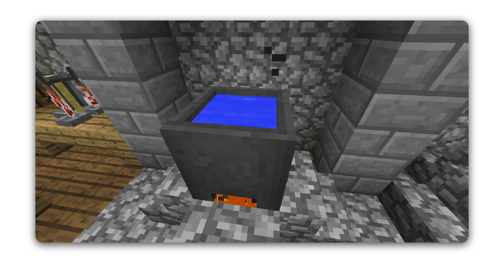
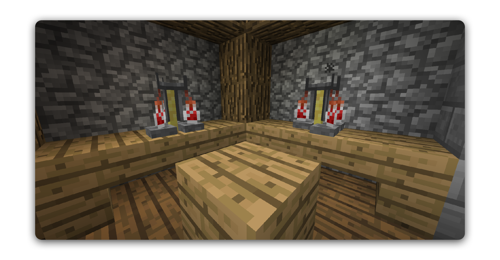
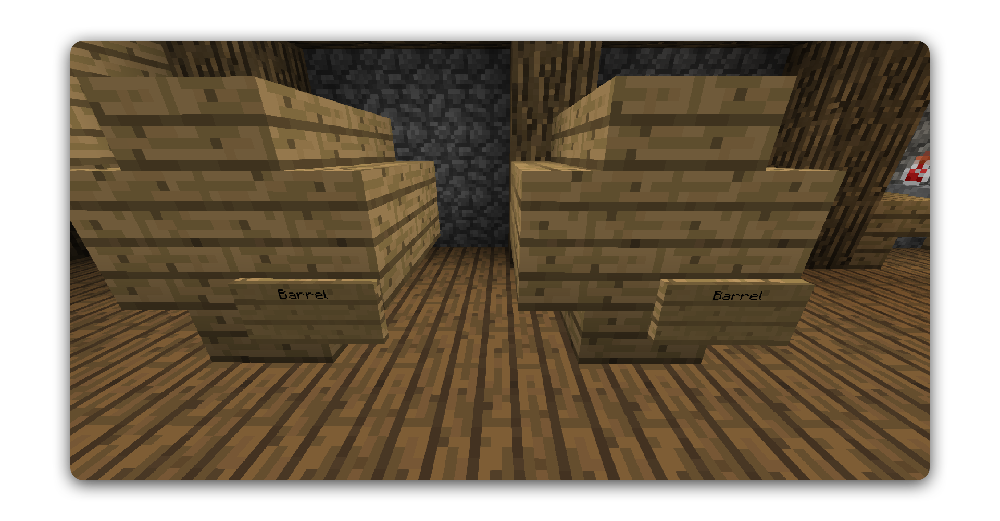
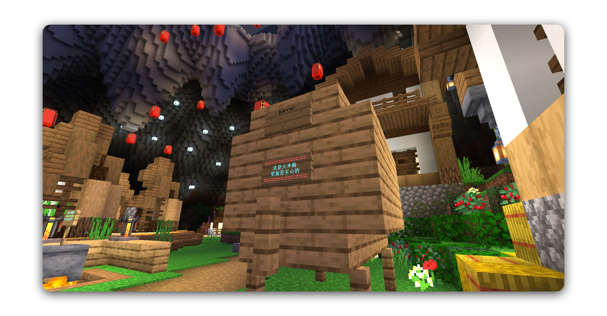

# 酿酒

## 制酒工序

### 发酵

第一步包括发酵新鲜的食材。

1. 将大锅放在火源或其他热源上
2. 装满水
3. 右键单击添加成分
4. 等他们发酵几分钟
5. 装满玻璃瓶

### 蒸馏

有一些酒在制作中不需要蒸馏这个步骤。

1. 将带有发酵物的玻璃瓶放入酿造台中
2. 将萤石粉作为催化剂放到最上面（蒸馏时不会消耗催化剂）

### 陈酿

陈酿酒需要一个桶，可以很小，也可以很大！

#### 迷你桶

#### 小桶

使用8个木制楼梯来构建桶形形状。

在右下角放置一个标牌，并在上面的行中写上 “Barrel”

#### 大桶

使用5个栅栏，16个木制楼梯和18个木板来构建桶形形状，别忘了在桶前面装好水龙头（栅栏）和一个写有“Barrel”的告示牌。

右击打开桶，将酒放入桶中静置。  
根据配方，用于建造桶的木材类型可能会改变陈酿的质量。

桶不应该在静置时被破坏，因为这会泄漏里面的美酒：\(

> #### 干杯！！！经过了重重工序，你终于能喝上美酒啦。酒内的酒精会在饮用时被激发，根据它的含量，这将有不同的效果。畅饮后希望你还能找到回家的路。

## 附录：配方

为了方便各位酒鬼，和魔法一样，我们也从官方摘录了配方，请享用。

| 配方 | 原料 | 发酵时间 | 蒸馏 | 陈置/木种 |
| :---: | :---: | :---: | :---: | :---: |
| 啤酒 | 6 小麦 | 8 分钟 | × | 3 年/任何 |
| Wheatbeer | 3 小麦 | 8 分钟 | × | 2 年/白桦 |
| Darkbeer | 6 小麦 | 8 分钟 | × | 3 times Beer Dark Oak |
| Red Wine | 5 Sweet Berries | 5 分钟 | × | Very Long Any |
| Mead | 6 Sugar Cane | 3 分钟 | × | 4 Years Oak |
| Apple Mead | 6 Sugar Cane Apple | Similar to Mead | × | 4 Years Oak |
| Apple Cider | Lots of Apple | 7/8 分钟 | × | 3 Years Any |
| Apple Liquor | Lots of Apple | 稍久 | √ | 6 Years Acacia |
| Whiskey | Wheat | 一个小麦一分钟 | √ | Very Long darker |
| Rum | Lots of Sugar Cane | 稍短 | √ | Long Oak |
| Vodka | A Sixth of a Stack Potatoes | 稍久 | √ | No |
| Mushroom Vodka | Potatoes, Mushrooms | 很久 | √ | No |
| Gin | 9 Wheat Some blue -flowers Apple | 稍短 | √ | No |
| Tequila | Some Cactus | 稍久 | √ | Long Birch |
| Absinthe | Lots of Grass | 稍久 | √ | No |
| Green Absinthe | Lots of Grass Another Greenish thing | 如常 | √ | No |
| Potato Soup | 5 Potatoes Some Grass | 稍短 | × | No |
| Coffee | Lots of Cocoa Beans 2 Milk Buckets | 稍短 | × | No |
| Eggnog | 5 Eggs A little sugar 1 Milk Bucket | 稍短 | × | Short Any |

